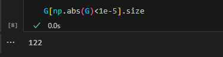
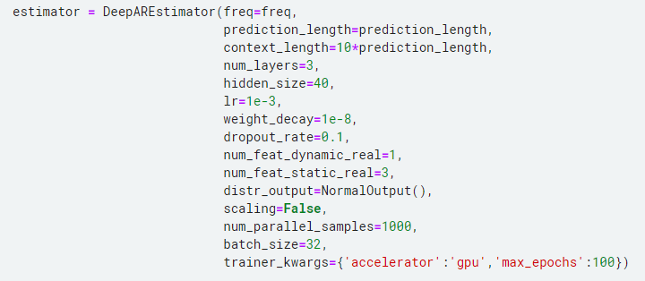
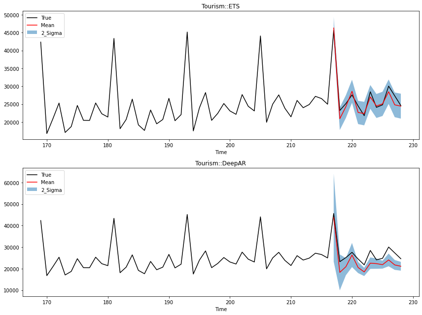
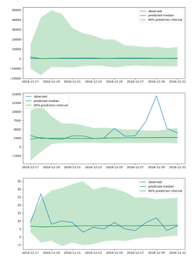
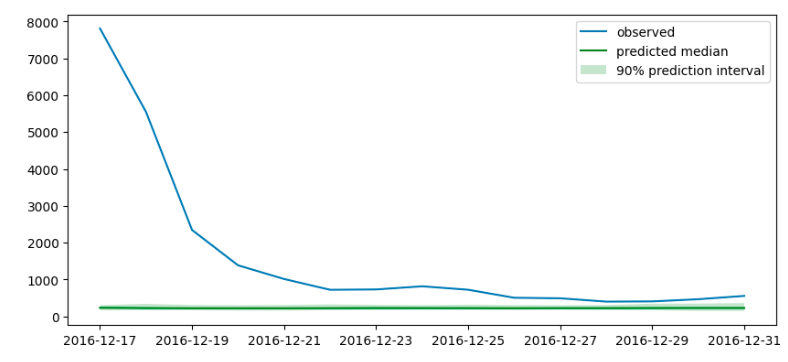
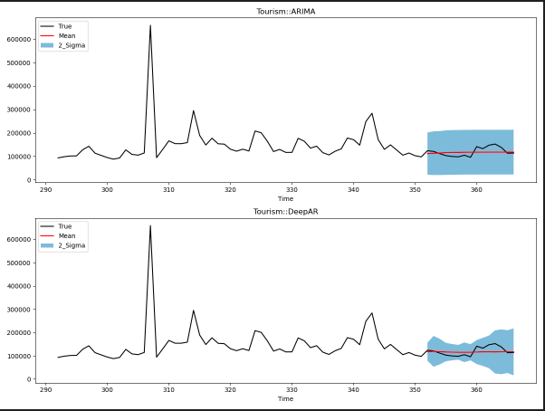
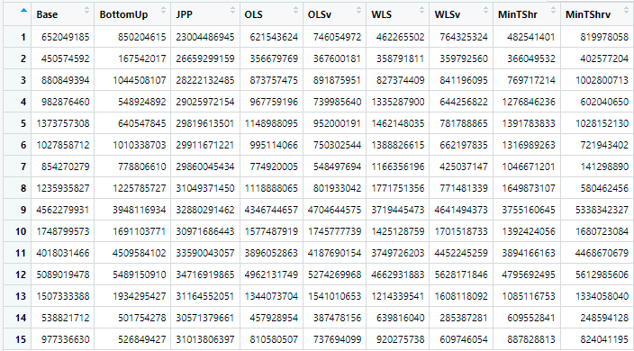
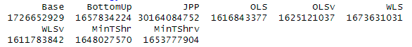

# Week10 2024424

## 一、汇报进展

### 1. 加入正则化项

* 手动指定参数为0的方法效果不行，尝试加入L1和L2正则化项鼓励加入稀疏性，同时防止过拟合。
* 方法：Optuna超参数寻优正则化参数，在loss函数中加入两个正则化项
* 稀疏性：

1. ETS没有正则化的稀疏性

2. ETS正则化的稀疏性

* 与没加入正则化项的结果对比

  能量得分

  | Base     | EnergyScore_Opt_1 | EnergyScore_Opt_2 |
  | -------- | ----------------- | ----------------- |
  | 12136570 | 13325934          | 13257646          |
  | 10277968 | 8651292           | 8675114           |
  | 4075830  | 4251442           | 4227332           |
  | 3100978  | 3920187           | 3889387           |
  | 6948099  | 5501885           | 5502098           |
  | 2077951  | 2497542           | 2452834           |
  | 4795166  | 3917599           | 3907010           |
  | 2522785  | 1367136           | 1383466           |
  | 2717445  | 2241834           | 2232059           |
  | 8637327  | 5915562           | 5939064           |
  | 11131377 | 8944232           | 8953707           |
  | 3346062  | 2071595           | 2079484           |

​	变差函数得分：

| Base_vs     | EnergyScore_Opt_vsv_1 | EnergyScore_Opt_vsv_2 |
| ----------- | --------------------- | --------------------- |
| 1286995684  | 1406048581            | 1399237574            |
| 996743024.1 | 886512639.2           | 888887047.5           |
| 363652387.8 | 436640041.9           | 433932503.8           |
| 326192641.2 | 410477504.9           | 407009316.2           |
| 665621022.8 | 562591805.5           | 562717534.7           |
| 204148505   | 250636119.7           | 245812527.8           |
| 462432163.3 | 400420377.8           | 399235114.9           |
| 260447679.5 | 133723030.1           | 135413511.4           |
| 261969637.1 | 211618350.6           | 210632176.1           |
| 842082120.2 | 598618757.3           | 601342017.2           |
| 1032230607  | 878891522             | 879839269.2           |
| 305726174.2 | 183822162.4           | 185020014.7           |

### 2. Tourism数据集

* 使用ARIMA和DeepAR生成基础预测

* 使用GPU跑DeepAR模型，加入了时间特征MOY，地理位置的类别编码

* 手动调整参数：

  

* 数据预处理，标准化stardardized：

* min-max预处理：

| Base(ETS) | Base(DeepAR) |
| --------- | ------------ |
| 12068156  | 37122554     |
| 10300300  | 31381155     |
| 4078732   | 24193671     |
| 3085153   | 17083967     |
| 6929631   | 20943435     |
| 2033826   | 16099478     |
| 4675661   | 49157346     |
| 2530360   | 9986253      |
| 2714433   | 14938075     |
| 8572794   | 52841136     |
| 11464074  | 42483239     |
| 3179308   | 17138282     |

* DeepAR的ES结果

| Base            | BottomUp     | JPP          | OLS          | OLSv         | WLS          | WLSv         | esopt        |
| --------------- | ------------ | ------------ | ------------ | ------------ | ------------ | ------------ | ------------ |
| 37122553.73     | 44158088     | 2.67E+08     | 34443499     | 34437543     | 38896838     | 36120358     | 37545702     |
| 31381154.96     | 39703430     | 70661127     | 31050701     | 31921794     | 32853401     | 32192238     | 30222057     |
| 24193670.91     | 28804146     | 41093370     | 23718714     | 24519797     | 24219911     | 23575460     | 23122418     |
| 17083966.73     | 15440348     | 56383745     | 16422787     | 16696800     | 16235629     | 16869168     | 7500510      |
| 20943435.35     | 21616564     | 47410392     | 20627761     | 21229067     | 20903511     | 21720224     | 21474410     |
| 16099477.62     | 12483528     | 35021427     | 15812286     | 17248399     | 12324830     | 17415741     | 17729303     |
| 49157346.1      | 39185349     | 72654772     | 49072803     | 49296656     | 45725511     | 49295671     | 45825772     |
| 9986253.393     | 8607178      | 40712115     | 9573570      | 9180685      | 8576746      | 8879502      | 5992555      |
| 14938075.13     | 11274734     | 38620708     | 14651506     | 14408499     | 13239164     | 14308060     | 13068676     |
| 52841136.31     | 37484732     | 73735451     | 52694126     | 52004835     | 50013491     | 51664632     | 47414578     |
| 42483238.78     | 43900154     | 57921960     | 42333274     | 42448223     | 44011880     | 42513923     | 41327429     |
| 17138281.5      | 21291219     | 30095866     | 17075460     | 17233051     | 18397112     | 17296686     | 17408617     |
| **27780715.87** | **26995789** | **69289114** | **27289707** | **27552112** | **27116502** | **27654305** | **25719336** |

* DeepAR基础预测相对效果不好，一些点预测拓展过来的方法可能保证了较差的基础预测不变，使得整体的预测反而下降了。

### 3. Wiki

* 使用ARIMA和DeepAR生成基础预测

* 若似然模型是泊松分布或者负二项分布，不做预处理：

  

* 若似然模型是正态分布，做scaling标准化处理：

  

## 二、问题与后续安排

### 1. 问题

* Wiki数据集的似然模型假设
* 选择一个不可变约束得到的效果不是很好，试试增加不可变节点数量

### 2. 后续安排

* 尝试自动化调参
* 增加不可变约束的数量
* 写论文的相关部分