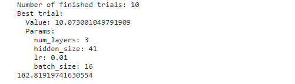
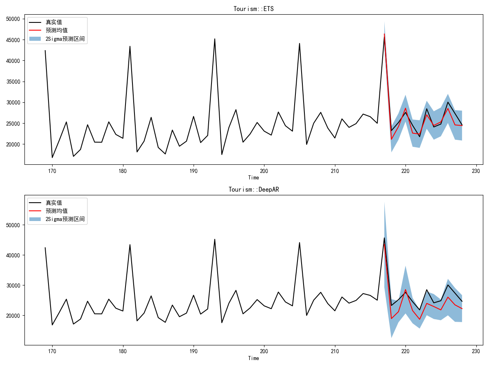
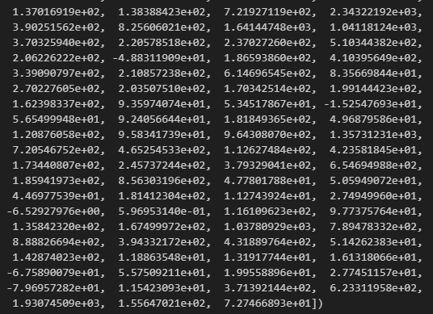
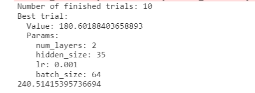
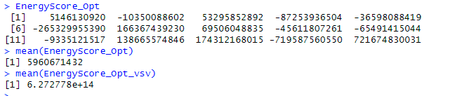
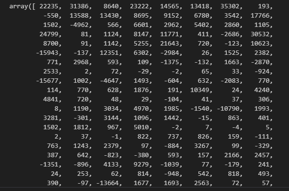
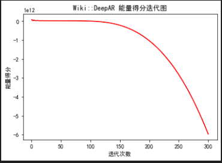

# Week11 202451

1. Tourism数据集精度问题

2. 使用库计算CRPS

3. 使得Optuna对DeepAR模型自动调参

4. DeepAR方法完善

5. 尝试多个不可变节点: 使用动态时间规整进行层次聚类，选了5个节点

6. Wiki结果有问题，换用了Labour数据集

   * ES出现了负数：猜测共线性

   * 数据特殊、离散、较为平稳：用ETS等预测效果不好，概率预测取样后的负数太多

     

     

* Tourism

* Wiki

