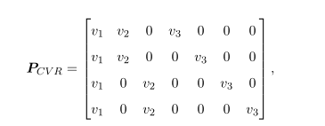
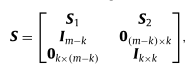
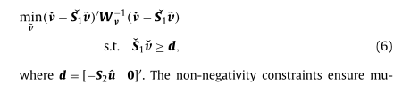
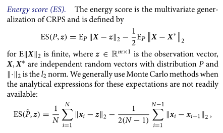
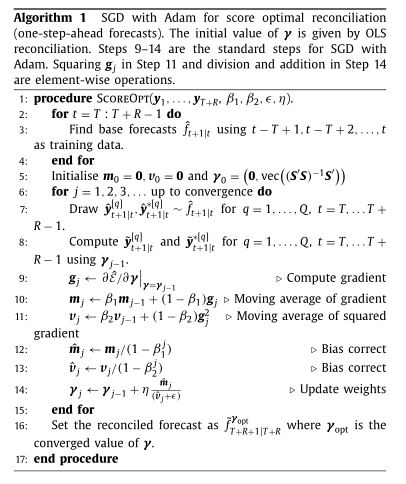
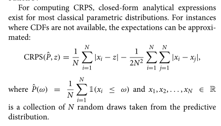

# Week2--2024/3/6

## 1. 综述部分的修改要点

> 1. 点预测的发展补充，最优组合预测、迹最小化
> 2. 概率预测的发展补充、重要性
> 3. 一致性的重要性
> 4. 点预测和概率预测的特点与局限性
> 5. 组合预测相关
> 6. 不可变节点的必要性

## 2. 文献

### Probabilistic forecast reconciliation with applications to wind power and  electric load

核心：提出了一种交叉验证（CV）以确定调和权重的方法，目标函数是最小化验证样本的平均CRPS，并用能量评分规则来评估最终结果。

1. 基础：Box-Cox、ARIMA-GARCH等，残差项设置为高斯、t、有偏t

2. 抽样：堆叠、排序、乱排

3. 调和：CRPS评分最优+CV   （对P矩阵的假设：和为1/和为1+非负/无约束）

4. 评估：能量评分

5. MCB Test

   

克罗内克积

## 3. 代码

| 模型                                  | 代码资源                                                     |
| ------------------------------------- | ------------------------------------------------------------ |
| ScoreOpt                              | https://github.com/anastasiospanagiotelis/ProbReco           |
| Probabilistic forecast reconciliation | https://github.com/PuwasalaG/Probabilistic-Forecast-Reconciliation |
| immutable forecast                    | https://github.com/AngelPone/chf                             |
| BTTH                                  | https://github.com/rshyamsundar/prob-hts                     |
| pyhts                                 | https://bohan-zhang.com/pyhts/tutorials/evaluation.html      |
| hierarchicalforecast                  | https://github.com/Nixtla/hierarchicalforecast               |
| DeepAR                                | https://docs.aws.amazon.com/sagemaker/latest/dg/deepar.html  |
| DeepTCN                               | https://github.com/oneday88/deepTCN                          |
| HierE2E                               | https://github.com/rshyamsundar/gluonts-hierarchical-ICML-2021 |
| discrete                              | https://github.com/AngelPone/DiscreteRecon                   |

## 4. 框架

### 1. 数据准备

| 数据               | 来源                        |
| ------------------ | --------------------------- |
| 蒙特卡洛           | 模拟生成                    |
| 私有数据集         | 零售商数据                  |
| 现实数据集（泛化） | traffic、electricity、M5... |

### 2. 数据预处理

1. 缺失值
2. 特征工程：周末、节假日、促销力度、滞后效应、窗口效应
3. Box-Cox转换
4. **基集时间序列的选取**和**不可变节点定义**
   1. 顶层
   2. 间歇性需求
   3. 长期数据

### 3. 基础概率预测

类别：独立预测、联合预测

方法集：ARIMA、LightGBM、单层前馈神经网络、VARX、Prophet、STS、DeepVR、核密度估计，组合预测

### 4. 抽取样本

### 5. 训练调和权重

$$
\tilde{y}_{t+h}=S\begin{bmatrix}
G_{1} & G_{2} & G_{3}\\
0_{k\times(n-m)} & 0_{k\times(m-k)} & I_{k\times k}
\end{bmatrix}
\begin{bmatrix}
\hat{w}_{t+h}\\
\hat{v}_{t+h}\\
\hat{u}_{t+h}
\end{bmatrix}
$$

目标函数：

1. 博涵学长的方法，计算量大、W矩阵设置？

   

   * 对于变化后的G矩阵有解析解
   * 非负约束：二次规划问题

   

2. 最小化能量评分 Energy Score

   

   

   

约束条件：

1. 不可变节点约束
2. 非负约束

方法：

1. 梯度方法
2. 罚函数
3. 智能优化

### 6. 评估

> 指标：CRPS
>
> 
>
> 维度：全局/分层次
>
> baseline模型：Base、扩展点预测（BU、OLS、WLS、MinT）、BTTH、JPP
>
> 补充：MCB Test

## 5. 问题和下周计划

问题：

1. 基础预测的生成是否需要分布的假设？

2. 基集怎么选取？（规模大的层次时间序列）

3. **抽样与调和**过程中怎么保证非负性约束？

   

下周计划：

1. 修改完善文献综述部分
2. 尝试参考数据集代码，写代码，跑跑模拟simulation