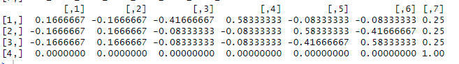
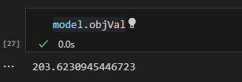
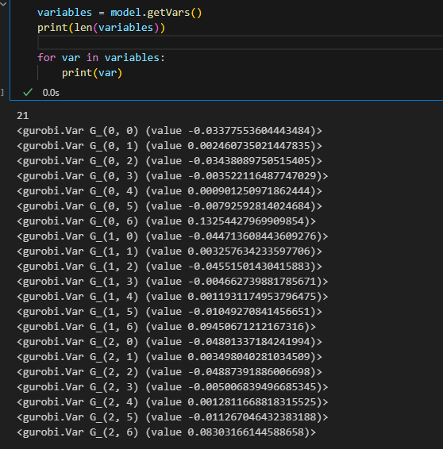
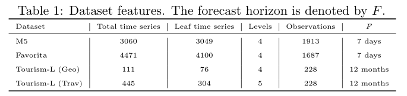

# Week 4 2024/3/21

## 一、模拟方法

### 1. chf

| 数据类型                | 拟合方法              | 有无不可变 | 调和方法                            |
| ----------------------- | --------------------- | ---------- | ----------------------------------- |
| 结构分解 、底层加入噪音 | ETS、ARIMA（top）+ETS | 有/无      | base、ols、wlss、wlsv、MinT(Shrink) |

基础预测：一次拟合300，向前预测24步，保留均值

W：insample_error的协方差矩阵（残差协方差矩阵）

评估：100次平均RMSE、分层+平均

### 2. Score

| 数据生成            | 拟合方法   | 基础预测生成               | 调和方法                                                     |
| ------------------- | ---------- | -------------------------- | ------------------------------------------------------------ |
| Arima高斯/平稳（4） | arima、ets | 高斯bootstrap/独立与非独立 | base、BU、ols、wls、MinT(Shrink)、MinT（Sample）、JPP、BTTH、ScoreOpt（E/V） |

基础预测：滚动窗口预测，向前预测1步，保留均值、标准差、残差矩阵等

W：insample_error的协方差矩阵（残差协方差矩阵）

评估：测试集内平均能量评分ES

### 3. 我的模拟

| 数据类型                          | 数据生成        | 拟合方法   | 基础预测生成     | 有无不可变 | 调和方法                                              |
| --------------------------------- | --------------- | ---------- | ---------------- | ---------- | ----------------------------------------------------- |
| 独立生成底层后聚合 、底层加入噪音 | ARIMA高斯非平稳 | ARIMA、ETS | 高斯独立、非独立 | 有/无      | base、BU、ols、wls、MinT(Shrink)、MinT（Sample）、JPP |

层次结构：1-2-4（7个序列），用ARIMA生成2000个数据，选择前510个数据，使用窗口大小为500的滑动窗口，测试集为10，不可变节点为顶层节点。

基础预测：滚动窗口预测，向前预测1步，保留均值、标准差、残差矩阵等

W：insample_error的协方差矩阵（残差协方差矩阵）

8个情况的数据结果：

|      | generate     | rootbasef | basefdep    |
| ---- | ------------ | --------- | ----------- |
| 1    | WithNoise    | ARIMA     | Independent |
| 2    | WithNoise    | ARIMA     | Joint       |
| 3    | WithNoise    | ETS       | Independent |
| 4    | WithNoise    | ETS       | Joint       |
| 5    | WithoutNoise | ARIMA     | Independent |
| 6    | WithoutNoise | ARIMA     | Joint       |
| 7    | WithoutNoise | ETS       | Independent |
| 8    | WithoutNoise | ETS       | Joint       |

## 二、模拟结果

* 引入学长对于加入不可变节点约束的点预测，拓展到概率预测的调和过程中，往前预测10步
* 考虑Energy Score和CRPS

### 1.WithNoise_ARIMA_Independent

* 每个预测时间步

  |      | Base     | BottomUp | JPP      | OLS      | OLSv     | WLS      | WLSv     | MinTSam  | MinTSamv | MinTShr  | MinTShrv |
  | ---- | -------- | -------- | -------- | -------- | -------- | -------- | -------- | -------- | -------- | -------- | -------- |
  | 1    | 469.4629 | 554.5025 | 1084.48  | 437.4342 | 420.486  | 457.4444 | 416.4056 | 410.1301 | 388.6046 | 394.8    | 394.9377 |
  | 2    | 195.5847 | 227.6596 | 809.7082 | 194.5959 | 190.471  | 200.5456 | 196.2395 | 223.5938 | 213.4198 | 208.8271 | 206.3795 |
  | 3    | 427.2891 | 508.966  | 1031.923 | 399.3098 | 397.287  | 409.5914 | 386.075  | 279.6136 | 259.4189 | 281.8928 | 274.5209 |
  | 4    | 372.6415 | 377.7185 | 977.5677 | 354.7083 | 352.578  | 353.827  | 347.2042 | 285.6678 | 305.644  | 297.7318 | 313.7036 |
  | 5    | 629.0948 | 718.334  | 1264.322 | 625.5557 | 601.7883 | 655.2738 | 621.6486 | 701.2884 | 689.1005 | 692.1513 | 676.675  |
  | 6    | 391.7117 | 781.6205 | 1063.213 | 290.3539 | 156.3924 | 433.7905 | 150.5965 | 116.9789 | 136.6925 | 124.2082 | 132.4043 |
  | 7    | 2025.115 | 2674.549 | 2768.04  | 1942.203 | 1727.819 | 2147.518 | 1732.094 | 1269.142 | 1291.29  | 1276.99  | 1300.284 |
  | 8    | 858.8528 | 869.5813 | 1389.058 | 804.1121 | 780.1055 | 763.2628 | 684.7379 | 642.3079 | 644.5018 | 681.8768 | 681.5446 |
  | 9    | 407.9566 | 1336.492 | 1127.179 | 252.4891 | 100.4709 | 480.5359 | 105.2093 | 92.38528 | 93.46172 | 76.71331 | 82.8897  |
  | 10   | 1715.933 | 2434.995 | 2439.931 | 1612.436 | 1545.047 | 1780.675 | 1587.162 | 1107.905 | 1131.472 | 1109.616 | 1145.009 |

### 2. WithNoise_ARIMA_Joint

* 每个时间步

  |      | Base     | BottomUp | JPP      | OLS      | OLSv     | WLS      | WLSv     | MinTSam  | MinTSamv | MinTShr  | MinTShrv |
  | ---- | -------- | -------- | -------- | -------- | -------- | -------- | -------- | -------- | -------- | -------- | -------- |
  | 1    | 468.0531 | 524.0923 | 1090.415 | 446.9354 | 430.5415 | 464.3124 | 424.1448 | 419.3543 | 390.5091 | 399.145  | 397.6716 |
  | 2    | 198.3423 | 227.2405 | 831.0118 | 198.1604 | 195.5048 | 204.4322 | 199.0824 | 230.8296 | 208.4556 | 212.4757 | 205.2384 |
  | 3    | 424.9008 | 469.6462 | 1048.52  | 404.4427 | 400.9733 | 414.1688 | 392.6715 | 281.8406 | 269.8582 | 286.2662 | 283.9418 |
  | 4    | 386.8226 | 379.2204 | 978.3904 | 368.473  | 366.4657 | 366.9852 | 361.6506 | 298.317  | 319.3411 | 310.8918 | 327.2213 |
  | 5    | 637.8947 | 710.0058 | 1265.903 | 633.7184 | 608.3153 | 660.5812 | 625.7683 | 706.4732 | 687.7431 | 696.847  | 677.8726 |
  | 6    | 376.8909 | 756.9374 | 1039.742 | 276.0931 | 143.7044 | 417.9691 | 137.6962 | 106.6807 | 117.7557 | 113.6599 | 118.1029 |
  | 7    | 2024.039 | 2711.037 | 2784.461 | 1943.789 | 1732.527 | 2152.549 | 1740.697 | 1283.177 | 1304.053 | 1287.856 | 1311.896 |
  | 8    | 845.5712 | 859.6975 | 1415.152 | 797.5799 | 771.9518 | 765.0425 | 687.1444 | 667.0874 | 670.8575 | 698.4557 | 698.5022 |
  | 9    | 390.3483 | 1278.413 | 1113.372 | 248.384  | 96.33689 | 472.7543 | 101.3053 | 72.01331 | 81.96325 | 69.76721 | 77.58146 |
  | 10   | 1690.919 | 2393.538 | 2412.947 | 1594.712 | 1526.753 | 1758.719 | 1565.698 | 1091.431 | 1110.655 | 1094.229 | 1126.268 |

  

* 平均ES

* 每个序列平均CRPS

  

## 三、文献整理

| 文献                                                         | description                                                  |
| ------------------------------------------------------------ | ------------------------------------------------------------ |
| A Top-Down Approach to Hierarchically Coherent Probabilistic Forecasting | 1. 顶层概率预测+比例学习 2. 训练、验证、测试 3. 平均CRPS 4. M5、Favorita、Tourism |
| Coherent Probabilistic Forecasts for Hierarchical Time Series | 1. PERMBU 2. 训练、验证、测试 3. CRPS QS 4. 模拟、smart meter |
| Combining Probabilistic Forecasts of Intermittent Demand     | 1. 学习组合预测的权重 2. 训练、验证、测试 3. 校准PIT、锐度、库存 4. M5 |
| DeepAR                                                       | 1. 最小化负对数似然函数学习参数                              |
| Discrete forecast reconciliation                             | 1. 最小化Brier分数 2. 训练、测试 3. Brier分数 4. MCB test |
| End-to-End Learning of Coherent Probabilistic Forecasts for Hierarchical Time Series | 1. 端到端的方法 2. 训练、验证、测试                |
| PROBABILISTIC FORECASTING WITH COHERENT AGGREGATION          | 1. Traffic tourism favorita                                  |
| Probabilistic forecast reconciliation with applications to wind power and  electric load | 1. 最小化验证期内的CRPS 2. 训练、验证、测试 3. ES  |
| Probabilistic Forecast Reconciliation under the Gaussian Framework | 1. 高斯框架下                                                |

### DeepAR

特点：

* 多步多变量的概率预测
* 支持协变量
* 方便处理尺度不同的时间序列
* 最小化负对数似然函数学习参数：正态、负二项

细节：

* 划分训练集、测试集
* 滚动窗口

## 四、分数最优化

学长的方法：

### gurobipy优化器：

* 目标函数：一步的能量分数，类似二次规划
* 约束：每个元素取值[-1,1]
* 学习参数：（4-1）*7=21

现实数据集（参数可能万级，百万级）：

### 模型

目标函数：
$$
f=\sum^{T+R-1}_{t=T}ES(\tilde{f}_{t+1|t},y_{t+1})
$$
设计：

* 训练集：T-h   490
* 验证集：h       10
* 测试集：h       10

## 五、后续规划

1. 完善一下评分最优方法
2. 完善模拟部分
3. 开始尝试实证部分
   1. 不可变节点设置

