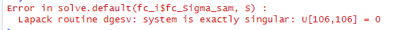
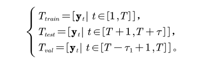
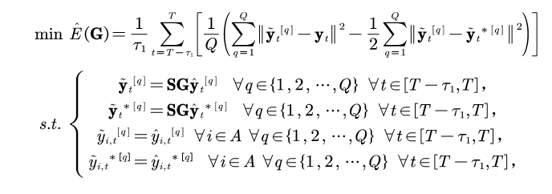
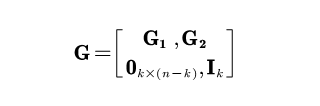
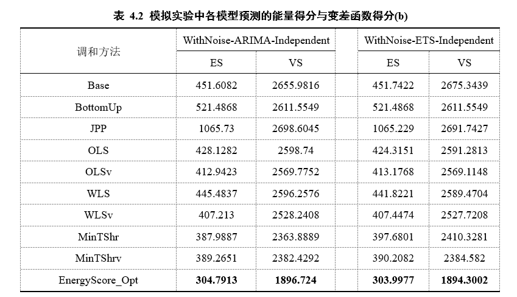
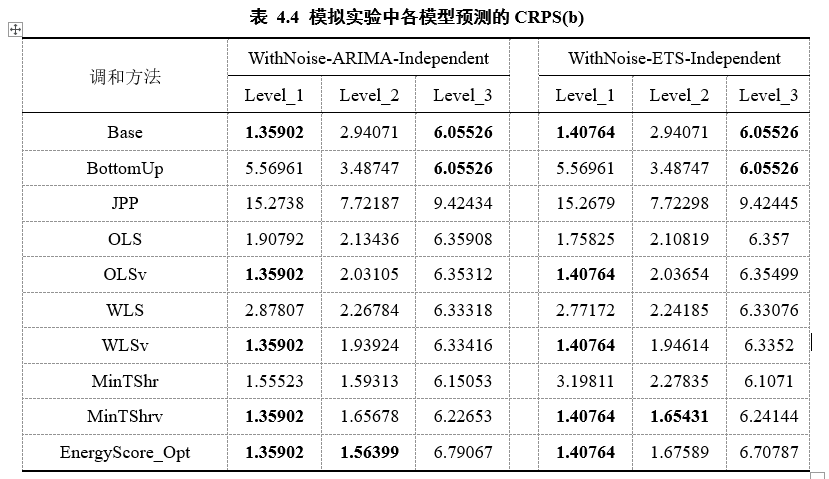
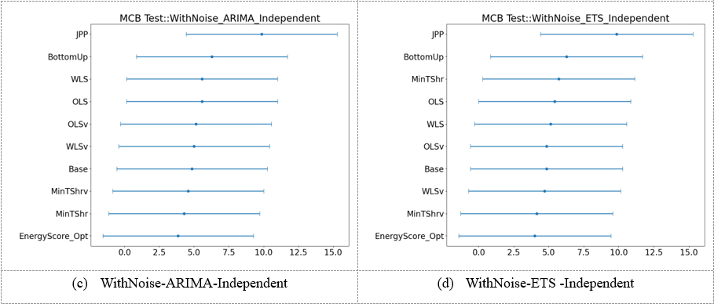
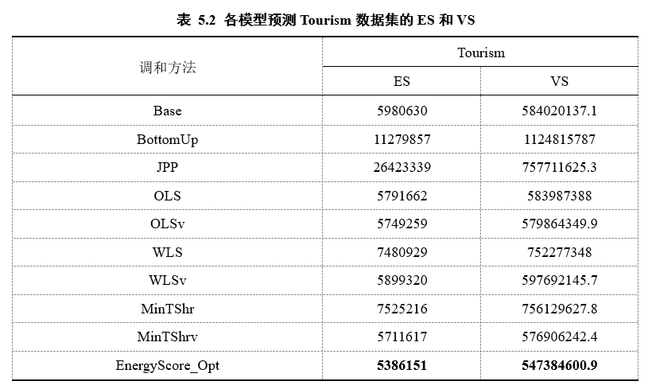
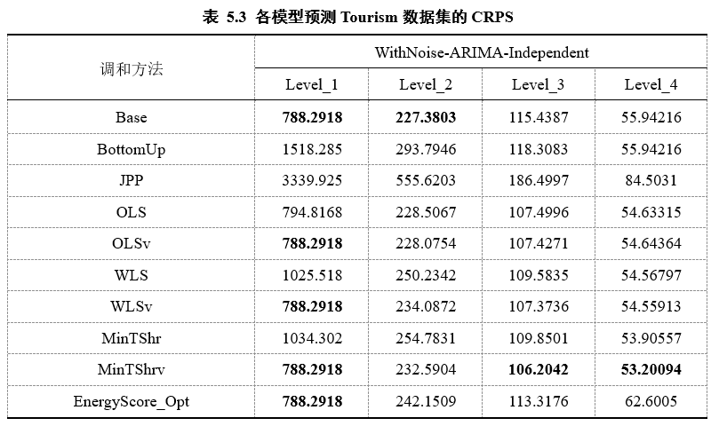

# Week7 2024/4/10

## 一、 本周进展

1. 完成中期报告
2. 研究进展：把模型应用到了蒙特卡洛模拟、Tourism数据集中
3. 后续工作：跑DeepAR模型，应用到Wiki数据集中

## 二、研究内容

1. 研究现状：

   * 现有的分层时间序列预测基本方法是首先生成基础预测，再通过调和的方式使得预测结果满足一致性要求。
   * 简单矩阵映射法虽然较为简单，但没有考虑到层次结构中不同层次的依赖关系。
   * 最优组合法能提供权重矩阵的精确解，且可以对层次结构节点间的线性聚合关系建模，但需要估计基础预测误差的协方差矩阵，但该矩阵通常不可估，而是通过样本内残差进行近似估计得到的，过程中会导致误差的累计。
   * 概率预测研究相对较少。带有不可变约束的调和方法在点预测中性能较优，可以应用到概率预测场景。

2. 研究目标：

   考虑带有不可变约束下的分层时间序列概率预测问题，设计算法模型，并将其应用于生成数据和现实数据集中，通过传统统计模型、深度学习、最优化方法等工具在满足一致性要求下，相比基线模型能实现较优的预测精度和较高的泛化能力，为相关分层时间序列预测领域提供预测工具与指导方法。

3. 研究方法：

   * 基础概率预测--抽样--对样本调和--得到一致概率预测的样本--在样本上做评估（ES VS CRPS）

4. 研究内容：

   * 将带有不可变约束的点预测方法直接拓展到概率预测框架下：
     * 优点：有精确的闭合形式解、求解方便
     
* 不足：需要估计W，会有误差累积；实际中可能因为多重共线性、数据量少而变量多等原因导致MinT的W矩阵不可逆
     
       
  
   * 以验证期内的平均能量得分ES为目标函数：
  * 首先将数据集划分为两个互不交叉的样本集，分别为用于生成未来概率预测的训练集 $$ T_{train} $$和用于预测与评估的测试集$$ T_{test} $$。假设训练集的结束时间步为$$ T $$，测试集的时间长度为$$ \tau $$，再构造一个验证集$$ T_{val} $$，使得验证集的时间长度为$$ \tau_{1} $$，保证验证集和测试集之间有一个固定的比例。在本研究中，采用$$ \tau_1/{\tau}=4 $$的比例。
   
    
   
  * 训练集用于生成测试集期间内的基础概率预测结果；验证集的基础概率预测结果由验证集以前的样本集生成，用于学习权重矩阵的权重参数；测试集使用该权重矩阵和重塑的加和矩阵对基础概率预测结果进行调和预测，得到一致的概率预测结果，并采用预测性能评估指标对概率预测结果进行评估。
   
     * 求解优化问题，最小化能量分数，基于样本估计。实际待估参数数量为$$ (m-k)\times{n} $$，求解方法：Gurobi优化器或者Adam优化器
   
       

## 三、实验结果

### 1. 模拟实验

hierarchy:1-2-4

使用ARIMA生成底层数据，向上聚合

顶层节点不变

|      | generate     | rootbasef | basefdep    |
| ---- | ------------ | --------- | ----------- |
| 1    | WithNoise    | ARIMA     | Independent |
| 2    | WithNoise    | ARIMA     | Joint       |
| 3    | WithNoise    | ETS       | Independent |
| 4    | WithNoise    | ETS       | Joint       |
| 5    | WithoutNoise | ARIMA     | Independent |
| 6    | WithoutNoise | ARIMA     | Joint       |
| 7    | WithoutNoise | ETS       | Independent |
| 8    | WithoutNoise | ETS       | Joint       |

* 使用前500个观测值向前预测1步
* 包括无不可变约束-不可变约束（R）-不可变约束（EnergyScore-Opt）--共10种方法
* 训练集-验证集-测试集: 4:1

### 2. Tourism

| 数据集  | 节点数量 | 底层节点数量 | 层次水平数量 | 历史观测数量 | 向前预测步长 |
| ------- | -------- | ------------ | ------------ | ------------ | ------------ |
| Tourism | 111      | 76           | 4            | 228          | 12           |

Hierarchy: 1-7-27-76

顶层节点不变

训练集为前216个月的数据，测试集为第217月至第228月的序列，使用训练集训练基础概率预测模型向前生成12步概率预测。

### 评价：

1. ES和VS上表现一致优，但CRPS不显著优

2. 迭代时间长，等待收敛需要时间

3. 待估计参数较多

   